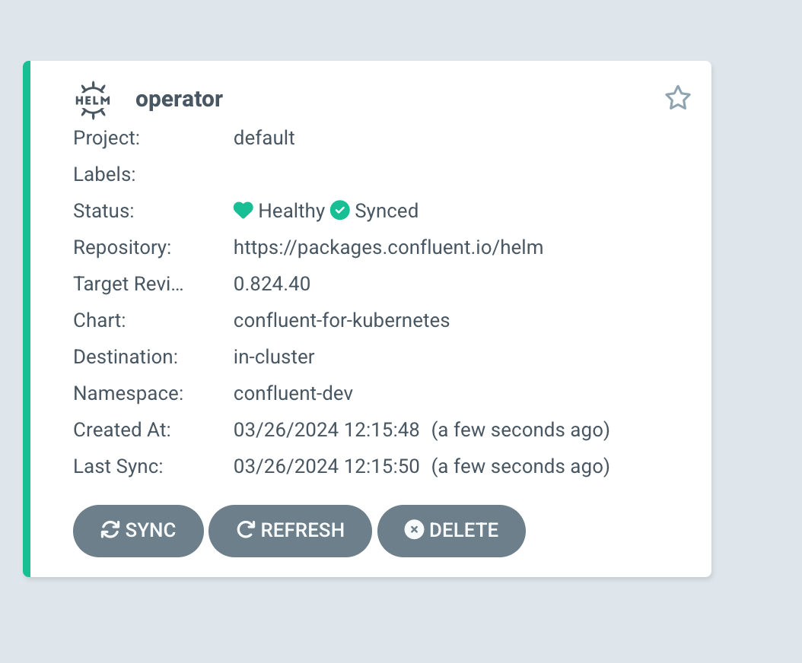

# Install ArgoCD

ArgoCD can be installed using either kubectl or Helm. Choose one of the following methods:

## Using kubectl

```shell
kubectl create namespace argocd
kubectl apply -n argocd -f https://raw.githubusercontent.com/argoproj/argo-cd/stable/manifests/install.yaml
```

## Verify argo status

```console
kubectl get all -n argocd
```

The output will be similar to

```console
NAME                                                    READY   STATUS    RESTARTS   AGE
pod/argocd-application-controller-0                     1/1     Running   0          2m18s
pod/argocd-applicationset-controller-7b9c4dfb77-j6j7z   1/1     Running   0          2m18s
pod/argocd-dex-server-9b5c6dccd-r9ndm                   1/1     Running   0          2m18s
pod/argocd-notifications-controller-756764ddd5-7vt26    1/1     Running   0          2m18s
pod/argocd-redis-69f8795dbd-7nqpm                       1/1     Running   0          2m18s
pod/argocd-repo-server-565fb47c89-49txx                 1/1     Running   0          2m18s
pod/argocd-server-86f64667bc-z29lc                      1/1     Running   0          2m18s

NAME                                              TYPE        CLUSTER-IP       EXTERNAL-IP   PORT(S)                      AGE
service/argocd-applicationset-controller          ClusterIP   10.111.117.180   <none>        7000/TCP,8080/TCP            2m18s
service/argocd-dex-server                         ClusterIP   10.108.32.9      <none>        5556/TCP,5557/TCP,5558/TCP   2m18s
service/argocd-metrics                            ClusterIP   10.102.142.243   <none>        8082/TCP                     2m18s
service/argocd-notifications-controller-metrics   ClusterIP   10.97.251.128    <none>        9001/TCP                     2m18s
service/argocd-redis                              ClusterIP   10.98.98.139     <none>        6379/TCP                     2m18s
service/argocd-repo-server                        ClusterIP   10.104.222.35    <none>        8081/TCP,8084/TCP            2m18s
service/argocd-server                             ClusterIP   10.109.35.157    <none>        80/TCP,443/TCP               2m18s
service/argocd-server-metrics                     ClusterIP   10.102.228.115   <none>        8083/TCP                     2m18s

NAME                                               READY   UP-TO-DATE   AVAILABLE   AGE
deployment.apps/argocd-applicationset-controller   1/1     1            1           2m18s
deployment.apps/argocd-dex-server                  1/1     1            1           2m18s
deployment.apps/argocd-notifications-controller    1/1     1            1           2m18s
deployment.apps/argocd-redis                       1/1     1            1           2m18s
deployment.apps/argocd-repo-server                 1/1     1            1           2m18s
deployment.apps/argocd-server                      1/1     1            1           2m18s

NAME                                                          DESIRED   CURRENT   READY   AGE
replicaset.apps/argocd-applicationset-controller-7b9c4dfb77   1         1         1       2m18s
replicaset.apps/argocd-dex-server-9b5c6dccd                   1         1         1       2m18s
replicaset.apps/argocd-notifications-controller-756764ddd5    1         1         1       2m18s
replicaset.apps/argocd-redis-69f8795dbd                       1         1         1       2m18s
replicaset.apps/argocd-repo-server-565fb47c89                 1         1         1       2m18s
replicaset.apps/argocd-server-86f64667bc                      1         1         1       2m18s

NAME                                             READY   AGE
statefulset.apps/argocd-application-controller   1/1     2m18s
```

## Get password

```console
kubectl -n argocd get secret argocd-initial-admin-secret -o jsonpath="{.data.password}" | base64 -d; echo
```

## Access ArgoCD UI

After installing ArgoCD, access the ArgoCD web UI using port-forwarding:

```console
kubectl port-forward svc/argocd-server -n argocd 8080:443
```

hen, open your web browser and navigate to http://localhost:8080. The user is admin and the password is the output of the step [above](get_password).


Further detail in the  following [link](https://apexlemons.com/devops/argocd-on-minikube-on-macos/)


## Deploy Confluet for kubernetes

Login in argo UI and add a new application. Copy and paste the following yaml.

```yaml
apiVersion: argoproj.io/v1alpha1
kind: Application
metadata:
  name: operator
  annotations:
    argocd.argoproj.io/sync-wave: "1"
spec:
  destination:
    name: ''
    namespace: confluent-dev
    server: 'https://kubernetes.default.svc'
  source:
    path: ''
    repoURL: 'https://packages.confluent.io/helm'
    targetRevision: 0.1193.1
    chart: confluent-for-kubernetes
    helm:
      parameters:
        - name: "namespaced"
          value: "false"
  sources: []
  project: default
  syncPolicy:
    automated:
      prune: true
      selfHeal: true
    syncOptions:
    - ServerSideApply=true
```

Or you can use the argocd cli

```shell
argocd login localhost:8080
argocd app create -f cfk_across_namespace.yaml
```

At the end you will see the following in argocd UI



## Deploy a CP Cluster

### Start Docker Compose

```bash
cd cp 
docker compose up -d
```

## Deploy a Confluet Cloud Cluster

### Create a new Standard cluster

1. Select Cloud provider
2. Fill in "Cluster name"

### Create a new Service Account
1. Navigate to Accounts & access
2. Add a new Service Account
3. Fill in Name and description
4. Assign role "CloudClusterAdmin" to the cluster created in previous step.
5. Finally create Service Account

### Create an API KEY

1. Add a new API Key
2. Select Service Account created in previous step.
3. Create ACL that allow create topic with prefix "demo"

## Shift-Left Validation with OPA

This repository implements **shift-left validation** for KafkaTopic resources using **Open Policy Agent (OPA)** integrated with GitHub Actions. This approach provides developers with immediate feedback on policy compliance directly in their pull requests, catching violations early in the development lifecycle.

### Why Shift-Left Validation?

Traditional cluster-side validation (like Gatekeeper) only catches policy violations when resources are deployed to the cluster. This creates a slower feedback loop and can block deployments at runtime. Our shift-left approach:

- ✅ **Faster Feedback**: Policy violations are caught during code review, not deployment
- ✅ **Developer Experience**: Clear error messages in familiar GitHub interface  
- ✅ **Cost Effective**: Prevents failed deployments and reduces cluster overhead
- ✅ **Early Detection**: Issues are resolved before they reach production environments

### Architecture Overview

The validation system consists of:

1. **OPA Rego Policy** (`policies/kafkatopic_naming.rego`) - Defines the naming convention rules
2. **GitHub Actions Workflow** (`.github/workflows/opa-validation.yml`) - Executes validation on every PR
3. **Test Resources** - Sample manifests for testing compliance

When a pull request is created, the GitHub Actions workflow automatically:

1. Detects any KafkaTopic manifests in the repository
2. Applies the OPA policy to validate naming conventions
3. Reports success or failure with detailed error messages
4. Blocks PR merging if validation fails

### KafkaTopic Naming Policy

All KafkaTopic resources must follow the naming convention defined in the OPA policy:

**Required Pattern:** `^demo-topic-[0-9]+$`

This means KafkaTopic names must:
- Start with the prefix `demo-topic-`
- End with one or more numeric digits
- Contain only lowercase letters, hyphens, and numbers

#### Valid Examples ✅

```yaml
# Valid: Follows the pattern exactly
apiVersion: kafka.strimzi.io/v1beta2
kind: KafkaTopic
metadata:
  name: demo-topic-123
  
# Valid: Single digit is acceptable
apiVersion: kafka.strimzi.io/v1beta2
kind: KafkaTopic
metadata:
  name: demo-topic-1
```

#### Invalid Examples ❌

```yaml
# Invalid: Missing required prefix
apiVersion: kafka.strimzi.io/v1beta2
kind: KafkaTopic
metadata:
  name: invalid-topic-123
  
# Invalid: Non-numeric suffix
apiVersion: kafka.strimzi.io/v1beta2
kind: KafkaTopic
metadata:
  name: demo-topic-test
  
# Invalid: Missing numeric suffix
apiVersion: kafka.strimzi.io/v1beta2
kind: KafkaTopic
metadata:
  name: demo-topic-
```

**Policy Source:** The authoritative source for this rule is the OPA Rego policy file located at `policies/kafkatopic_naming.rego`.

### Local Validation

Developers can validate their KafkaTopic manifests locally before creating a pull request. This helps catch policy violations early and speeds up the development process.

#### Prerequisites

First, install the OPA CLI tool:

```bash
# macOS with Homebrew
brew install open-policy-agent/tap/opa

# Linux/macOS with curl
curl -L -o opa https://openpolicyagent.org/downloads/v0.58.0/opa_linux_amd64_static
chmod 755 ./opa
sudo mv opa /usr/local/bin

# Windows with Chocolatey
choco install opa
```

#### Running Local Validation

To validate a KafkaTopic manifest file locally:

```bash
# Navigate to the repository root
cd /path/to/cfk-control-plane-argocd

# Validate a specific manifest file
opa eval -d policies/kafkatopic_naming.rego \
  --input data/CC/topicsCloud.yml \
  "data.kafkatopic.naming.allow"

# Expected output for valid manifest: true
# Expected output for invalid manifest: false
```

#### Validation Examples

**Valid manifest validation:**
```bash
$ opa eval -d policies/kafkatopic_naming.rego \
  --input data/CC/topicsCloud.yml \
  "data.kafkatopic.naming.allow"
true
```

**Invalid manifest validation:**
```bash
$ opa eval -d policies/kafkatopic_naming.rego \
  --input test-resources/invalid-prefix-topic.yaml \
  "data.kafkatopic.naming.allow"
false
```

For detailed error messages, you can also query the denial reason:

```bash
opa eval -d policies/kafkatopic_naming.rego \
  --input test-resources/invalid-prefix-topic.yaml \
  "data.kafkatopic.naming.deny[_]"
```

This will output the specific error message explaining why the manifest failed validation.

### GitHub Actions Automated Validation

The repository includes a GitHub Actions workflow that automatically validates all KafkaTopic manifests on every pull request. This ensures policy compliance before code is merged.

#### Workflow Overview

The **OPA Validation** workflow (`.github/workflows/opa-validation.yml`) performs the following steps:

1. **Checkout**: Downloads the repository code and pull request changes
2. **Install OPA**: Sets up the OPA CLI tool in the GitHub Actions environment  
3. **Find KafkaTopic Manifests**: Automatically discovers all YAML files containing KafkaTopic resources
4. **Run Validation**: Executes the OPA policy against each discovered manifest
5. **Report Results**: Provides detailed success or failure information

#### Viewing Workflow Results

To check the validation results for your pull request:

1. **Navigate to your PR** on GitHub
2. **Look for the "Checks" section** at the bottom of the PR description
3. **Find the "OPA Validation" check** in the list of status checks
4. **Click "Details"** to view the full workflow log

#### Understanding Validation Failures

When a KafkaTopic manifest violates the naming policy, the workflow will fail with a detailed error message. Here's an example of a typical failure log:

```
Run echo "Validating changed files: test-resources/invalid-prefix-topic.yaml"
Validating changed files: test-resources/invalid-prefix-topic.yaml
Found KafkaTopic in test-resources/invalid-prefix-topic.yaml, running OPA validation...
❌ Validation failed for test-resources/invalid-prefix-topic.yaml
Denial reasons:
[
  "KafkaTopic name 'invalid-topic-123' is invalid; must start with 'demo-topic-'. Example of valid name: 'demo-topic-123'"
]
❌ One or more KafkaTopic resources failed validation
Error: Process completed with exit code 1.
```

#### Key Points for Developers

- **Blocking Behavior**: A failed OPA validation check will **prevent PR merging** until the issues are resolved
- **Fast Feedback**: Results are typically available within 1-2 minutes of creating/updating a PR
- **Clear Error Messages**: The workflow provides specific guidance on how to fix naming violations
- **Multiple Files**: The workflow validates all KafkaTopic manifests in the repository, not just changed files

#### Troubleshooting Tips

1. **Check the specific error message** in the workflow log for the exact naming violation
2. **Verify your KafkaTopic name** matches the pattern `^demo-topic-[0-9]+$`
3. **Test locally first** using the commands in the Local Validation section above
4. **Update your manifest** and push the changes to trigger a new validation run

## Deploy a new ArgoCD App for CC

### Create App

Login in argo UI and add a new application. Copy and paste the following yaml.


```yaml
apiVersion: argoproj.io/v1alpha1
kind: Application
metadata:
  name: confluent-cloud
spec:
  destination:
    namespace: confluent-cloud
    server: 'https://kubernetes.default.svc'
  source:
    path: data/CC
    repoURL: https://github.com/sotojuan2/cfk-control-plane-argocd
    targetRevision: HEAD
  sources: []
  project: default
  syncPolicy:
    syncOptions:
      - CreateNamespace=true
    automated:
      prune: false
      selfHeal: false
```

Or you can use the argocd cli

```shell
argocd login localhost:8080
argocd app create -f cfk_confluent_cloud.yaml
```
### Validate 
1. Navigate to topic. Now you can see a new topic has created ('demo-topic-1')
2. Navigate to stream governance. New subject has created('demo-topic-1-value').


## Deploy a new ArgoCD App for CP

### Create a new App

Login in argo UI and add a new application. Copy and paste the following yaml.


```yaml
apiVersion: argoproj.io/v1alpha1
kind: Application
metadata:
  name: confluent-cp
spec:
  destination:
    namespace: confluent-cp
    server: https://kubernetes.default.svc
  source:
    path: data/CP
    repoURL: https://github.com/sotojuan2/cfk-control-plane-argocd
    targetRevision: HEAD
  sources: []
  project: default
  syncPolicy:
    syncOptions:
      - CreateNamespace=true
    automated:
      prune: false
      selfHeal: false
```

Or you can use the argocd cli

```shell
argocd login localhost:8080
argocd app create -f cfk_confluent_cp.yaml
```

### Validate 
1. Navigate to control center - topic. Now you can see a new topic has created ('demo-topic-1')


## Create a new Topic  

Create a new Topic that doesn't match the rule.

### Validate the Rule was trigger

```shell
kubectl get events --all-namespaces --sort-by='.lastTimestamp' --field-selector type=Warning
```